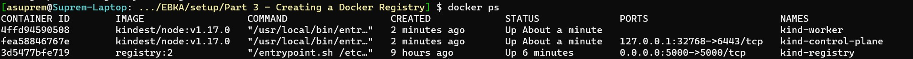

# Docker Registry

So one thing you may have noticed in our earlier parts is that Kubernetes deploys a docker image for a pod. For example, when we ran the `hello-node` pod in part 1, we used

``` 
sudo kubectl create deployment hello-node --image=k8s.gcr.io/echoserver:1.4
```

Here the image comes from a docker registry. The most common one is [dockerhub](https://hub.docker.com/), but there are other registries as well.

However, when deploying your own pods, you may need to customize it to perform some task. Normally, the workflow is:

1. Create Dockerfile for your custom image
2. Run Dockerfile to create image
3. Verify the image in some way
4. Push the image to dockerhub to your username
5. Refer to the image in your kubernetes pod specification with `your-dockerhub-username/image-name`

This way, Kubernetes will automatically pull the image from dockerhub. But this is not a production solution, because in most cases, you would be exposing your internal code to the public, sicne anyone can read/use a Docker image. In addition, if you are using API Keys, these would be exposed as well.

The solution is to use a private registry in addition to the public registry. This way, you can poll either the public dockerhub registry or your private docker registry for any image for a kubernetes pod. Fortunately, docker provides a registry Docker image.

## Setting up
Deploying the registry requires us to tie it to the Kubernetes cluster, so you'll have to start from scratch on a new cluster. Delete any existing KinD cluster you have.

Then download the `registry-config.yaml` and the `kind-with-registry.sh` files.

- `registry-config.yaml` sets up access to the registry
- `kind-with-registry.sh` sets up the actual registry. By default, I set it up with 1 control-plane node and 1 worker node. In the future, this may need to be increased. If so, you would just add a new line in the file around line 60 where it sets up the cluster, and add a new node with `- role: worker`

## Deploying the registry

First run the shell script:

```
sudo sh kind-with-registry.sh
```

Once the script is finished, you can check the status of the vms with `docker ps`:



## Testing the registry

Now we will deploy a couple images to the registry outside of kubernetes. The registry should be hosted at `localhost:5000`.

```
docker pull busybox
docker tag busybox localhost:5000/busybox
docker push localhost:5000/busybox
```

Basically, you are first pulling the `busybox` image from dockerhub, tagging it for your private registry, then pushing it to the private registry.

### Running dockerhub pod

To run the image from dockerhub, use:

```
kubectl run -i --tty --rm debug --image=busybox --restart=Never -- sh
```

This will create an interactive pod that you can explore; the pod will delete after exit. You can exit the pod with `exit`.


### Running local registry pod

To run the image pushed to the local registry, use:

```
kubectl run -i --tty --rm debug --image=localhost:5000/busybox --restart=Never -- sh
```

Here we explicitly tell kubernetes to get the pod from the local registry.

### Registry GUI

Sometimes you want to check what containers/images are on your registry. You can use the registry's API for this, [described here](https://docs.docker.com/registry/spec/api/). 

You can access the catalog of images in the registry with, e.g. `http://localhost:5000/v2/_catalog`. But using the various APIs is a bit cumbersome. Fortunately, other people think so too and have created GUIs to view the registry.

A pretty good one is the [Joxit Registry UI](https://github.com/Joxit/docker-registry-ui). You can run it with:

```
docker pull joxit/docker-registry-ui:latest
docker run -d -p 80:80 joxit/docker-registry-ui
```

You can access the GUI at `http://localhost:80`. 

Unfortunately, since you are running the registry and the GUI on the same machine, your browser will prevent them from communicating with each other. This is called CORS, or Cross-Origin Resource Sharing. This is an intended safety feature for browsers - basically to prevent access to protected files. [You can learn more here](https://en.wikipedia.org/wiki/Cross-origin_resource_sharing). 

(Aside: To bypass it, I created the `registry-config.yaml`, but haven't been able to get it to work. I've left it here in case anyone wants to try the safer approach. What follows is a slighty hacky approach.)

**The Hacky Approach**: We'll tell the browser to allow CORS. There are various extensions available for Chrome/Edge/Firefox that do this. If you are on Edge/Chrome, the one I use is this [Allow CORS extension](https://chrome.google.com/webstore/detail/allow-cors-access-control/lhobafahddgcelffkeicbaginigeejlf). A disclaimer: Please be very careful installing extensions. If you don't feel comfortable, or if the page looks fishy, etc don't install it. At the end of the day, you are better off using the cumbersome method of manual API calls versus the worst-case-scenario of a bricked machine.

Now you can access the Joxit GUI at `http://localhost:80`. You will need to add your registry's url (which is `localhost:5000`) before you can see the pushed images.


This is intended as an ephemeral solution, as it takes up valuable system resources (i.e. memory, CPU) when deployed, so make sure to shut down the container when you are done with:

```
docker kill <CONTAINER-ID>
```

You can get the container id with `docker ps`.

**The Cumbersome Method**: As I mentioned, you can directly use the API on your browser without any messing around with CORS. Here are a couple useful endpoints:


- `http://localhost:5000/v2/_catalog/`: This will show you the catalog of repositories. After deploying `busybox`, you should get `{'repositories': ['busybox']}` as your response
- `http://localhost:5000/v2/<repo>/tags/list`: This will show the available tags for a repository. If you run `http://localhost:5000/v2/busybox/tags/list`, you should get back `{"name":"busybox","tags":["latest"]}`
- `http://localhost:5000/v2/<repo>/manifests/<tag>`: This will get the manifest for the specified container. You can run `http://localhost:5000/v2/busybox/manifests/latest`


## Teardown

You can delete the registry and cluster with 

```
sudo sh teardown-kind-with-registry.sh
```

or by manually killing the registry container from its container id and deleting the cluster with `kind`